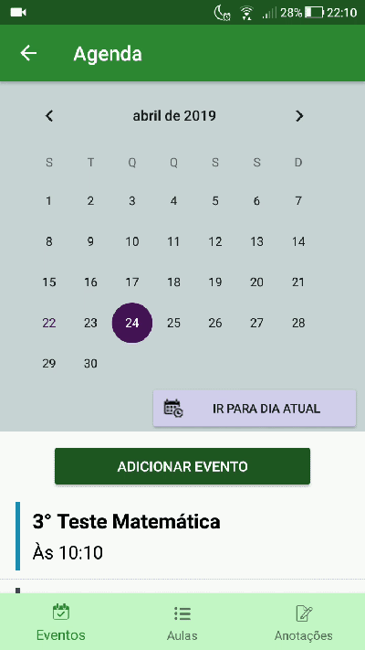
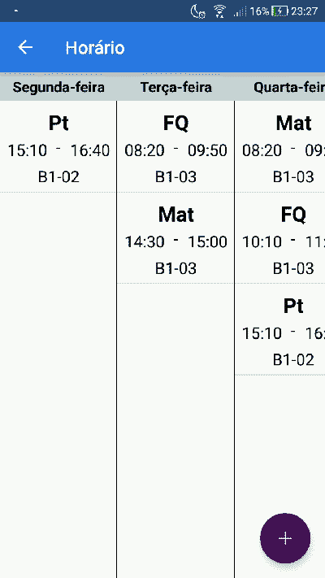
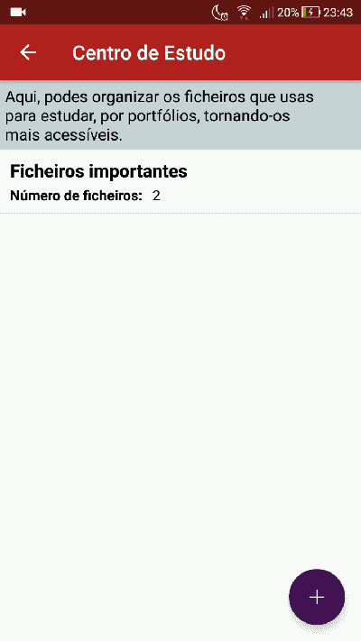
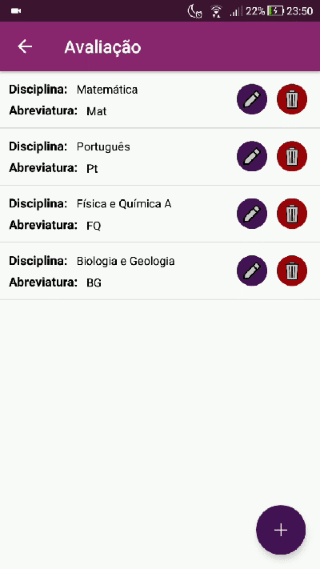

# 4Students

> NOTE 1: Project made when I was learning autonomously Java and native Android development, before knowing about Git, Project structuring and Design/Code Patterns

This Android App was created to help students and teachers organize their academic life. With this purpose, the app has functionalities like a Calendar, where the user can register/see his occurrences for the day (events, lessons, annotations), a Timetable, where the user saves his weekly lessons and a Study Center, where he can organize his study files. It also has an Evaluation section, where the student can register his subjects and its evaluation criteria, so he can calculate/simulate his grades. The teachers can also register all their students in this section to calculate their grades.

> Note 2: The app was created in portuguese only

This app won an Honorable Mention at FCT NOVA Challenge 2019 (Science/technology High School contest promoted by FCT NOVA and U.S. Embassy & Consulate In Portugal)

## Home page

## Calendar page

## Timetable page

## Study Center

## Evaluation page

